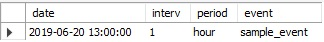

# elasticsearch_to_sql
<h2>Dynamic Process to pull elasticsearch data, paginate through results, and post to SQL db</h2>

<h4>This project is configured to run a single template .py file with a config .yml file to parse elasticsearch results and post the results to SQL. For each new query, a config file can be created and passed in the arguments, so the .py file should never need updates after first setup.</h4>

For the query configuration, I use a simple table:

```
CREATE TABLE `elastic_configuration` (
  `date` datetime,
  `interv` int(11) ,
  `period` varchar(15),
  `event` varchar(250) COLLATE utf8mb4_unicode_ci)
```

Sample SQL config output: 
<br>


In the .yml file, define the fields in your destination table:
  fields: <br>
        - datetime # for the timestamp field, included by default. <br>
        - country # sample fields, add or remove as desired. Must match the fields retrieved from ES. <br>
        - user_id <br>
        - uuid <br>
        - action <br>
        - context <br>
        - referrer <br>
        
Then define the path to these fields in the elasticsearch JSON results:
  fields: # sample path to field values. Code looks to nested hits / hits for attributes.  <br>
         - country: '_source.query_params.country' <br>
         - user_id: '_source.query_params.user_id' <br>
         - uuid: '_source.query_params.uuid' <br>
         - action: '_source.query_params.action' <br>
         - context: '_source.query_params.context' <br>
         - referrer: '_source.referrer' <br>
 
Requirements: <br>
DateTime>=4.3 <br>
mysql-connector>=2.1.4 <br>
pandas>=0.23.4 <br>
PyYAML>=3.13 <br>
SQLAlchemy>=1.2.14 <br>
timedelta>=2018.11.20 <br>
